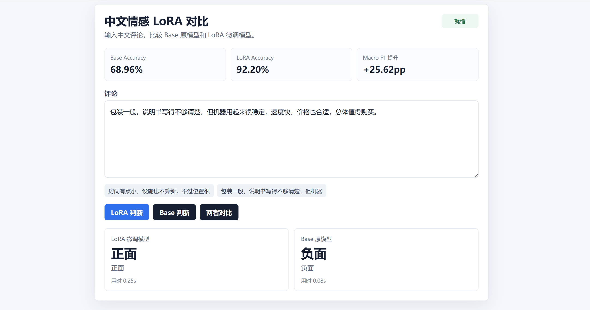

# tune-lab

`tune-lab` 是一个中文情感分类 LoRA 微调实验项目。项目目标不是做开放式聊天，而是用公开数据集做一个可以量化证明微调效果的端到端案例：数据转换、QLoRA 训练、Base/LoRA 自动评测、FastAPI 推理服务和前端对比页面。

当前任务使用公开中文情感分类数据集 ChnSentiCorp：输入一条中文评论，模型只输出 `正面` 或 `负面`。因为测试集有标准答案，所以可以直接比较 Base 原模型和 LoRA 微调模型的 Accuracy、Macro F1 和格式合规率。

## 为什么选择情感分类

开放式客服回复很难证明“微调后更好”，因为同一个问题可以有很多种合理回答。情感分类是标准监督任务，评测更清楚：

- `Accuracy`：预测是否正确。
- `Macro F1`：正负样本是否都学到。
- `Format Valid`：是否严格只输出 `正面` 或 `负面`。
- `Error Cases`：保留错误样例，方便复盘。

## 项目结构

```text
tune-lab/
  configs/
    qwen2.5_0.5b_chnsenticorp_lora_smoke.yaml
    qwen2.5_0.5b_chnsenticorp_lora.yaml
  frontend/
    app.js
    index.html
    styles.css
  scripts/
    run_wsl_setup.sh
    train_smoke.sh
    train_quick.sh
    train_full.sh
    evaluate.sh
    serve_ui.sh
  src/domain_tune_lab/
    prepare_chnsenticorp.py
    train_sentiment_lora.py
    evaluate_sentiment_models.py
    serve_sentiment.py
```

## 快速开始

在 WSL2 Ubuntu 中执行：

```bash
cd /path/to/tune-lab
bash scripts/run_wsl_setup.sh
```

如果提示缺少 `python3-venv`：

```bash
bash scripts/install_wsl_system_deps.sh
```

训练 smoke test：

```bash
bash scripts/train_smoke.sh
```

全量训练：

```bash
bash scripts/train_full.sh
```

评测：

```bash
bash scripts/evaluate.sh
```

启动前端测试台：

```bash
bash scripts/serve_ui.sh
```

默认地址：

```text
http://localhost:7861/
```

## 当前实验结果

已完成一次可展示的 LoRA 微调实验：

- 训练数据：公开 ChnSentiCorp train split 中 1928 条有效样本。
- 验证数据：公开 ChnSentiCorp valid split 中 391 条有效样本。
- 测试数据：公开 ChnSentiCorp test split 全量 1179 条。
- 基座模型：`Qwen/Qwen2.5-0.5B-Instruct`。
- 微调方法：4bit QLoRA，LoRA 可训练参数约 879.8 万，占总参数 1.75%。
- 输出 adapter：`checkpoints/qwen2.5-0.5b-chnsenticorp-lora`。

| 模型 | Accuracy | Macro F1 | Format Valid | Avg Latency |
| --- | ---: | ---: | ---: | ---: |
| Base | 68.96% | 66.57% | 100.00% | 0.07s |
| LoRA | 92.20% | 92.20% | 100.00% | 0.13s |

结论：在公开测试集上，LoRA 相比 Base 的 Accuracy 提升 23.24 个百分点，Macro F1 提升 25.62 个百分点。Base 明显偏向预测 `负面`，LoRA 后正负样本召回更均衡。

## 前端效果

同一句“有缺点但整体值得购买”的评论，LoRA 能判断为 `正面`，Base 原模型容易被局部负面词误导为 `负面`。



## 数据说明

训练、验证、测试数据均从公开 ChnSentiCorp 数据集转换而来。项目不使用自建客服规则数据，也不混入人工构造答案。

## License

本项目代码使用 MIT License。数据集和基础模型请遵守各自原始许可证与使用条款。
